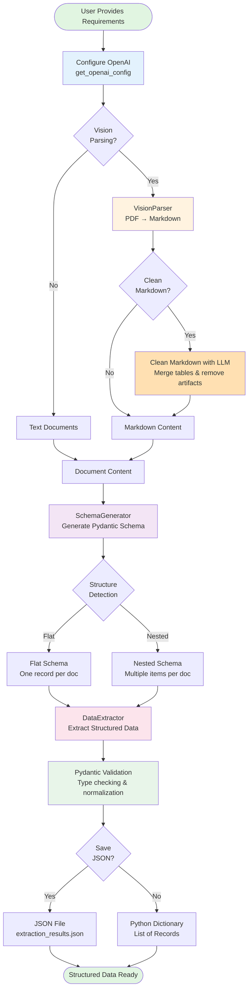

# Knowledge Extraction Using Dynamic Schema Generation

Extract structured data from documents using natural language requirements. Automatically generates Pydantic schemas and validates extracted data.

## Features

- **Natural Language → Schema**: Describe extraction needs in plain English
- **Auto Structure Detection**: Automatically detects flat vs nested data patterns
- **Type-Safe Extraction**: Pydantic validation with structured outputs
- **Modular Architecture**: Separate schema generation and data extraction
- **Multi-Provider Support**: Works with Azure OpenAI and standard OpenAI
- **PDF Processing**: Built-in PDF to markdown conversion using PyMuPDF

## Workflow



## Installation

```bash
# Install dependencies
pip install -r requirements.txt

# Configure environment
cp .env.example .env
# Edit .env with your API keys
```

## Configuration

Create a `.env` file with your credentials:

```env
# Azure OpenAI
AZURE_API_KEY=your_azure_key_here

# Standard OpenAI (alternative)
OPENAI_API_KEY=your_openai_key_here
```

## Quick Start

### Basic Extraction

```python
from extraction_config import get_openai_config
from schema_generator import SchemaGenerator
from data_extractor import DataExtractor

# Step 1: Configure OpenAI client (choose Azure or standard OpenAI)
config = get_openai_config(use_azure=True)  # Set to False for standard OpenAI

# Step 2: Generate schema from requirements
generator = SchemaGenerator(config=config)

requirements = """
Extract project information:
- Project title (string)
- Budget in EUR (decimal)
- Start date (date)
- Status (enum: active or completed)
"""

schema = generator.generate_schema(user_requirements=requirements)

# Step 3: Extract data using the generated schema
extractor = DataExtractor(config=config)

documents = [
    """
    Project: AI Research Initiative
    Budget: 2,500,000 EUR
    Start Date: 2024-01-15
    Status: Active
    """
]

results = extractor.extract(
    extraction_model=schema,
    requirements=generator.item_requirements,
    user_requirements=requirements,
    documents=documents
)

print(results)
```

### With JSON Export

```python
# Extract and save to JSON in one step
results = extractor.extract(
    extraction_model=schema,
    requirements=generator.item_requirements,
    user_requirements=requirements,
    documents=documents,
    save_json=True,
    json_path="extraction_results.json"
)
```

### PDF Processing

```python
from extraction_config import get_openai_config
from parsers.vision_parser import VisionParser

# Configure parser
config = get_openai_config(use_azure=True)
parser = VisionParser(
    openai_config=config,
    use_context=True,      # Use previous page context for better continuity
    dpi=300,               # Image resolution (200-300 recommended)
    clean_output=True      # Merge and clean tables across pages
)

# Parse PDF to markdown
markdown_pages = parser.convert_pdf("input/document.pdf")
parser.save_markdown(markdown_pages, "output/document.md")

# Use markdown as extraction input
results = extractor.extract(
    extraction_model=schema,
    requirements=generator.item_requirements,
    user_requirements=requirements,
    documents=markdown_pages  # Use parsed markdown
)
```

## API Providers

### Azure OpenAI

```python
from extraction_config import get_openai_config

# Default configuration
config = get_openai_config(use_azure=True)

# All classes use the same config
generator = SchemaGenerator(config=config)
extractor = DataExtractor(config=config)
parser = VisionParser(openai_config=config)
```

Configuration includes:
- Deployment: `gpt-4.1`
- Endpoint: Configured in `extraction_config.py`
- API Version: `2024-12-01-preview`

### Standard OpenAI

```python
from extraction_config import get_openai_config

# Switch to standard OpenAI
config = get_openai_config(use_azure=False)

# All classes use the same config
generator = SchemaGenerator(config=config)
extractor = DataExtractor(config=config)
parser = VisionParser(openai_config=config)
```

Configuration includes:
- Model: `gpt-4.1-2025-04-14`
- Uses standard OpenAI API

### Custom Models

```python
# Override model for specific component
generator = SchemaGenerator(config=config, model="gpt-4o")
extractor = DataExtractor(config=config, model="gpt-4o-mini")
```

## Project Structure

```
extractors/
├── extraction_config.py      # Shared OpenAI configuration
├── schema_generator.py       # Dynamic schema generation
├── data_extractor.py         # Data extraction engine
├── extraction_example.py     # Usage example
├── extractor.py              # Complete PO+BOM pipeline
├── parsers/
│   ├── vision_parser.py      # PDF → Markdown (PyMuPDF + Vision API)
│   ├── pymupdf_parser.py     # Fast text-based PDF parser
│   └── docling_parser.py     # Alternative parser
└── input/                    # Input documents
```

## Core Classes

### SchemaGenerator

Generates Pydantic schemas from natural language requirements.

```python
from extraction_config import get_openai_config
from schema_generator import SchemaGenerator

config = get_openai_config(use_azure=True)
generator = SchemaGenerator(config=config)

# Generate schema
schema = generator.generate_schema(
    user_requirements="Extract: name (string), age (int), email (string)"
)

# Access generated components
print(generator.extraction_model)      # Pydantic model
print(generator.item_requirements)     # Field specifications
print(generator.structure_analysis)    # Flat vs nested detection
```

### DataExtractor

Extracts structured data using pre-generated schemas.

```python
from extraction_config import get_openai_config
from data_extractor import DataExtractor

config = get_openai_config(use_azure=True)
extractor = DataExtractor(config=config)

# Extract data
results = extractor.extract(
    extraction_model=schema,           # From SchemaGenerator
    requirements=requirements,         # Field specifications
    user_requirements=requirements_text,
    documents=["doc1", "doc2"],
    save_json=True,                    # Optional JSON export
    json_path="results.json"
)
```

### VisionParser

Converts PDFs to markdown using Vision API.

```python
from extraction_config import get_openai_config
from parsers.vision_parser import VisionParser

config = get_openai_config(use_azure=True)
parser = VisionParser(
    openai_config=config,
    use_context=True,
    dpi=300,
    clean_output=True
)

markdown_pages = parser.convert_pdf("document.pdf")
```

## Key Concepts

### User Requirements

Describe extraction needs in plain English:

```python
requirements = """
For each invoice item, extract:
- Item number (string)
- Description (string)
- Quantity (integer)
- Unit price (decimal)
- Total (decimal)
"""
```

### Structure Detection

The system automatically detects:
- **Flat**: One record per document (e.g., invoice header)
  ```
  Extract: invoice_number, total, date
  ```
- **Nested**: Multiple items per document (e.g., invoice line items)
  ```
  Extract items from invoice:
  - item_number
  - description
  - quantity
  ```

### Field Types

Supported types:
- `str` - Text strings
- `int` - Integers
- `float` - Floating point numbers
- `decimal` - Precise decimal numbers
- `bool` - Boolean values
- `date` - Date strings (auto-converted to ISO format)
- `list[str]` - Lists of strings
- `list[dict]` - Nested structures

### Field Validation

```python
requirements = """
Extract:
- Email (string, pattern: ^[a-z0-9._%+-]+@[a-z0-9.-]+\.[a-z]{2,}$)
- Status (enum: draft, pending, approved, rejected)
- Amount (decimal, format: currency-eur)
- Date (date, format: iso-date)
- Required field (required: true)
- Optional field (required: false)
"""
```

## Advanced Usage

### Complete Workflow

```python
from extraction_config import get_openai_config
from schema_generator import SchemaGenerator
from data_extractor import DataExtractor
from parsers.vision_parser import VisionParser

# 1. Configure (once for all components)
config = get_openai_config(use_azure=True)

# 2. Parse PDF documents
parser = VisionParser(openai_config=config, dpi=300, clean_output=True)
markdown_docs = parser.convert_pdf("invoice.pdf")

# 3. Generate extraction schema
generator = SchemaGenerator(config=config)
schema = generator.generate_schema(
    user_requirements="""
    Extract invoice line items:
    - Item number (string)
    - Description (string)
    - Quantity (int)
    - Unit price (decimal)
    - Total (decimal)
    """
)

# 4. Extract structured data
extractor = DataExtractor(config=config)
results = extractor.extract(
    extraction_model=schema,
    requirements=generator.item_requirements,
    user_requirements="...",
    documents=markdown_docs,
    save_json=True,
    json_path="invoice_data.json"
)

# 5. Use results
for record in results:
    print(f"Item: {record['item_number']} - {record['description']}")
    print(f"Total: {record['total']}")
```

### Batch Processing

```python
import os
from pathlib import Path

# Configure once
config = get_openai_config(use_azure=True)
parser = VisionParser(openai_config=config)
generator = SchemaGenerator(config=config)
extractor = DataExtractor(config=config)

# Generate schema once
schema = generator.generate_schema(user_requirements=requirements)

# Process multiple PDFs
pdf_folder = Path("input/")
for pdf_file in pdf_folder.glob("*.pdf"):
    print(f"Processing {pdf_file.name}...")

    # Parse
    markdown = parser.convert_pdf(str(pdf_file))

    # Extract
    results = extractor.extract(
        extraction_model=schema,
        requirements=generator.item_requirements,
        user_requirements=requirements,
        documents=markdown,
        save_json=True,
        json_path=f"output/{pdf_file.stem}_data.json"
    )
```

### Custom Prompts for PDF Parsing

```python
custom_prompt = """
Convert this document to markdown.
Focus on:
1. Preserve all table data exactly as shown
2. Keep numerical values precise
3. Maintain document structure
4. Do not hallucinate or invent content
"""

parser = VisionParser(
    openai_config=config,
    custom_prompt=custom_prompt,
    dpi=300
)
```

## Examples

Complete examples available:
- **extraction_example.py** - Basic schema generation and extraction
- **extractor.py** - Complete PO+BOM matching pipeline with PDF parsing

Run examples:
```bash
python extraction_example.py
python extractor.py
```

## Performance Tips

1. **Reuse config**: Create config once, pass to all components
   ```python
   config = get_openai_config(use_azure=True)
   generator = SchemaGenerator(config=config)
   extractor = DataExtractor(config=config)
   ```

2. **Generate schema once**: Reuse schema for multiple documents
   ```python
   schema = generator.generate_schema(requirements)
   # Use same schema for all documents
   ```

3. **Batch extraction**: Process multiple documents in one call
   ```python
   results = extractor.extract(
       extraction_model=schema,
       requirements=requirements,
       user_requirements=requirements_text,
       documents=[doc1, doc2, doc3, ...]  # Multiple docs
   )
   ```

4. **Optimize PDF parsing**: Adjust DPI based on document quality
   ```python
   parser = VisionParser(
       openai_config=config,
       dpi=200,  # Lower DPI for simple documents
       clean_output=False  # Skip merge step if not needed
   )
   ```

## Troubleshooting

### Import Errors
```bash
# Install missing dependencies
pip install -r requirements.txt
```

### API Key Issues
```python
# Verify environment variables
import os
print(os.getenv("AZURE_API_KEY"))  # Should not be None
```

### Schema Generation Issues
- Provide clear, specific requirements
- Use concrete examples in requirements
- Specify field types explicitly

### Extraction Quality
- Improve PDF parsing with higher DPI
- Use custom prompts for specific document types
- Enable context for multi-page documents

## Contributing

See [WORKFLOW.md](WORKFLOW.md) for development guidelines.

## License

[Add your license here]
