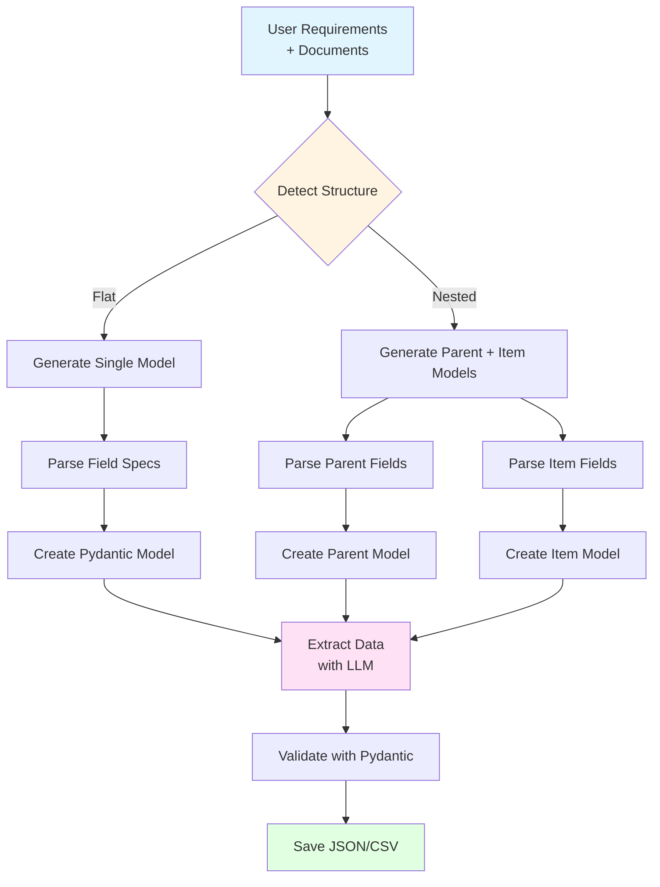

# Extraction Workflow

## Key Components

### Phase 1: Structure Detection
- **Input:** User requirements text
- **Process:** LLM analyzes if data is flat or nested
- **Output:** "flat" or "nested_list"

### Phase 2: Schema Generation
- **Parse Specifications:** Extract field names, types, constraints
- **Build Pydantic Models:** Dynamic model creation with validation rules
- **Handle Relationships:** Parent-child for nested structures

### Phase 3: Data Extraction
- **Structured Output:** Uses OpenAI's Pydantic response format
- **Deterministic:** Temperature=0, seed for reproducibility
- **Retry Logic:** Exponential backoff for failures

### Phase 4: Output
- **JSON:** Full structured data with metadata
- **CSV:** Flattened tabular format (optional)
